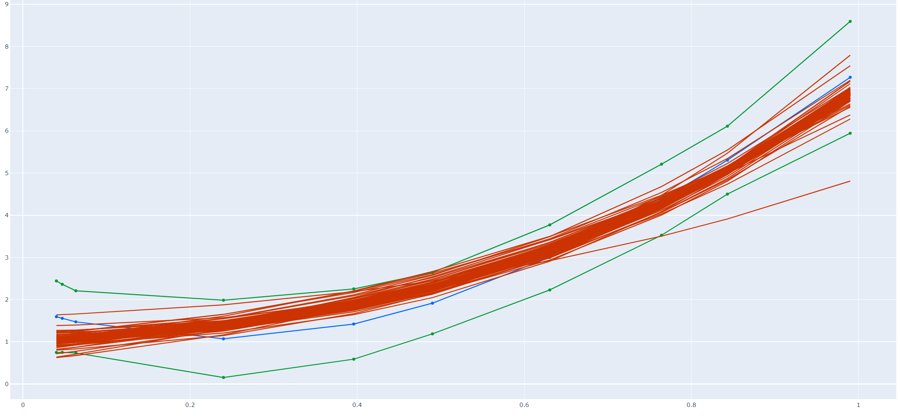

> Given data on two variables $X$ and $Y$, consider fitting a cubic polynomial regression model $f(X)=\sum_{j=0}^3\beta_jX^j$. In addition to plotting the fitted curve, you would like a 95% confidence band about the curve. Consider the following two approaches:
> 
> (a) At each point $x_0$, form a 95% confidence interval for the linear function $a^T\beta=\sum_{j=0}^3\beta_jx_0^j$.
>
> (b) Form a 95% confidence set for $\beta$ as in (3.15), which in turn generates confidence intervals for $f(x_0)$.
>
> How do these approaches differ? Which band is likely to be wider? Conduct a small simulation experiment to compare the two methods.

## Solution

For the first method, at each point $\textbf{x}_0$, the variance of $\hat y_0 = \textbf{x}_0\hat\beta$ is

\begin{equation}
    \text{Var}(\hat y_0) = \textbf{x}_0 \text{Var}(\hat\beta) \textbf{x}_0^T = \textbf{x}_0 (\textbf{X}^T\textbf{X})^{-1}\textbf{x}_0^T.\nonumber
\end{equation}

Then at each sample $(\textbf{x}_0, y_0)$, the confidence interval is calculated as 

\begin{equation}
\hat y_0\pm 1.96 \sqrt{\textbf{x}_0 (\textbf{X}^T\textbf{X})^{-1}\textbf{x}_0^T}.\nonumber	
\end{equation}

For the second method, denote $\beta$ as the true value of coefficients, we have

\begin{equation}
    C_\beta = \{\beta|(\hat\beta-\beta)^T\textbf{X}^T\textbf{X}(\hat\beta-\beta)\le \sigma^2\chi^2_{4, 0.05}\}.\nonumber
\end{equation}

The confidence region for $\hat\beta$ is found by inverting the inequality above with respect to $\hat\beta$. To do that, we first make Cholesky decomposition of $\textbf{X}^T\textbf{X}=\textbf{U}^T\textbf{U}$ where $\textbf{U}$ is upper triangular. Therefore, for vectors $\hat\beta$ at the boundary of the confidence region, $\textbf{U}(\hat\beta-\beta)$ lies on the 4-dimensional ball with radius $r = \sigma \sqrt{\chi^2_{4, 0.05}}$. Hence for any vector $\gamma\in\mathbb{R}^4$, we can first normalize it to the ball with radius $r$ and the arrive $\hat\beta$ by

\begin{equation}
    \hat\beta = \textbf{U}^{-1}\left(\gamma \cdot \frac{r}{\|\gamma\|}\right) + \beta.\nonumber
\end{equation} 

Note that the confidence region from the first method is expected to be wider than that from the second method. The reason is that the region from the first method is a *simultaneous confidence region*, that is, each of the coordinate $\beta_i$ falls into the region with the given probability. While the one from the second is an *elliptical confidence region*, it's less strict than the simultaneous one thus it's narrower. This is also observed from Figure 1 below.


<center>*Figure 1: Confidence Regions from Two Different Methods*</center>

Figure 1 is drawn from a numerical simulation experiment. In the simulation we first draw 10 values, $\{x_i, i=1,...,10\}$ ,uniformly from $[0,1]$. Then we generate
$y_i = 1 + x_i + 2x_i^2 + 3x_i^3 + \epsilon_i$ with $\epsilon_i\sim N(0, 0.5)$. That is, the true value for $\beta$ is $\beta = (1,1,2,3)^T\in \mathbb{R}^4$. 

```python
import numpy as np

# prepare X
ones = np.ones(n)
x = np.random.uniform(0, 1, n)
x = np.sort(x)
x_square = np.square(x)
x_cubic = np.power(x, 3)

X = np.column_stack((ones, x, x_square, x_cubic))
X_T = X.transpose()

# prepare Y
epsilon = np.random.normal(0, sigma, n)

beta = np.array([1, 1, 2, 3])
y_theory = X @ beta
y_realized = y_theory + epsilon
```

We then calculate confidence regions following the procedures described above. 

```python
# method 1
from numpy.linalg import inv
from scipy.stats import chi2

var_beta_hat = inv(X_T @ X) * (sigma**2)
tmp = X @ var_beta_hat
tmp = tmp @ X_T
width = np.diag(tmp)
width = np.sqrt(width)
width_upper = y_estimated + 1.96 * width
width_lower = y_estimated - 1.96 * width
```

Note that in the second method, we sample 100 different vectors $\gamma$ and thus obtain 100 different $\hat\beta$ (of course, finally 100 different `curves' via $\textbf{X}\hat\beta$).

```python
# method 2
U_T = np.linalg.cholesky(X_T @ X)
U = U_T.transpose()
U_inv = inv(U)

p = 0.95
df = 4
num = 100

region_arr = []

for i in range(num):
    a = np.random.normal(0, 1, df)
    a = U_inv @ a
    a_norm = np.linalg.norm(a, ord=2)

    r = sigma * np.sqrt(chi2.ppf(p, df))
    a = a * (r/a_norm)

    beta2 = beta + a
    region = np.dot(X, beta2)
    region_arr.append(region)
```

The blue line is calculated from $\hat\beta^{\text{OLS}}$, the two green lines are the 95% confidence region band from the first method, and the red lines are sampled from the boundary of the 95% confidence set from the second method. Note that most red ones lie in the confidence region formed by the green boundaries, however, they have the freedom to jump out.

```python
# plot
import plotly.graph_objects as go

fig = go.Figure()
fig.add_trace(go.Scatter(x=x, y=y_estimated, mode='lines+markers', name='estimated', line_color='#0066ff'))
fig.add_trace(go.Scatter(x=x, y=width_upper, mode='lines+markers', name='upper1', line_color='#009933'))
fig.add_trace(go.Scatter(x=x, y=width_lower, mode='lines+markers', name='lower1', line_color='#009933'))

for i in range(num):
    fig.add_trace(go.Scatter(x=x, y=region_arr[i], mode='lines', line_color='#cc3300'))

fig.show()
```

## Code 
```python
import numpy as np
import plotly.graph_objects as go
from numpy.linalg import inv
from scipy.stats import chi2

n = 10
sigma = np.sqrt(0.5)

# prepare data
ones = np.ones(n)
x = np.random.uniform(0, 1, n)
x = np.sort(x)
x_square = np.square(x)
x_cubic = np.power(x, 3)

X = np.column_stack((ones, x, x_square, x_cubic))
X_T = X.transpose()

epsilon = np.random.normal(0, sigma, n)

beta = np.array([1, 1, 2, 3])
y_theory = X @ beta
y_realized = y_theory + epsilon

beta_hat = inv(X_T @ X) @ X_T @ y_realized
y_estimated = X @ beta_hat

# method 1
var_beta_hat = inv(X_T @ X) * (sigma**2)
tmp = X @ var_beta_hat
tmp = tmp @ X_T
width = np.diag(tmp)
width = np.sqrt(width)
width_upper = y_estimated + 1.96 * width
width_lower = y_estimated - 1.96 * width


# method 2
U_T = np.linalg.cholesky(X_T @ X)
U = U_T.transpose()
U_inv = inv(U)

p = 0.95
df = 4
num = 100

region_arr = []

for i in range(num):
    a = np.random.normal(0, 1, df)
    a = U_inv @ a
    a_norm = np.linalg.norm(a, ord=2)

    r = sigma * np.sqrt(chi2.ppf(p, df))
    a = a * (r/a_norm)

    beta2 = beta + a
    region = np.dot(X, beta2)
    region_arr.append(region)

# plot
fig = go.Figure()
fig.add_trace(go.Scatter(x=x, y=y_estimated, mode='lines+markers', name='estimated', line_color='#0066ff'))
fig.add_trace(go.Scatter(x=x, y=width_upper, mode='lines+markers', name='upper1', line_color='#009933'))
fig.add_trace(go.Scatter(x=x, y=width_lower, mode='lines+markers', name='lower1', line_color='#009933'))

for i in range(num):
    fig.add_trace(go.Scatter(x=x, y=region_arr[i], mode='lines', line_color='#cc3300'))

fig.show()

```