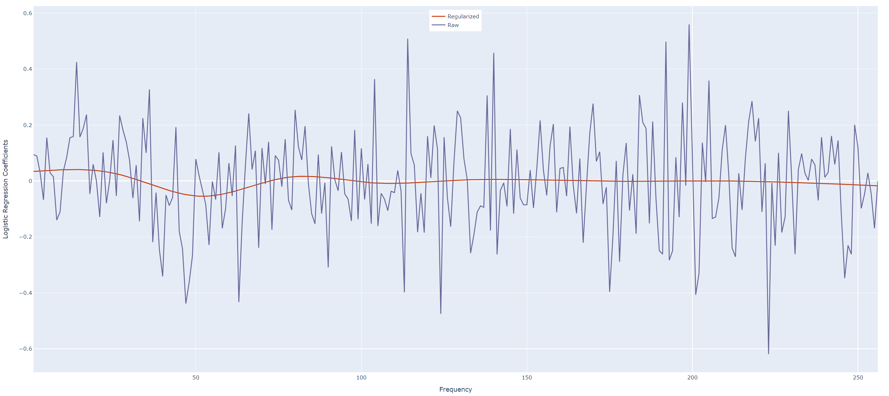

???+ question "Ex. 5.5"
    Write a program to classify the *phoneme* data using a quadratic discriminant analysis (Section 4.3). Since there are many correlated features, you should filter them using a smooth basis of natural cubic splines (Section 5.2.3). Decide beforehand on a series of five different choices for the number and position of the knots, and use tenfold cross-validation to make the final selection. The phoneme data are available from the book [website](www-stat.stanford.edu/ElemStatLearn).

??? done "Soln. 5.5" 
    We first try to reproduce lower panel of Figure 5.5 in the text. First we fit the raw data using a logistic regression as mentioned in the text. This will give us jagged gray curve. Second, to use natural cubic spline to *filter* input $p=256$ frequencies, we need to get the *basis matrix* $\bb{H}\in\mathbb{R}^{p\times 12}$ of natural cubic spline on integer set $\{1,2, ..., 256\}$ with degree of freedom 11. Then we replace original $\bX\in\mathbb{R}^{N\times p}$ with $\bX^\ast = \bX\bb{H}$, and fit a logistic regression using $\bX$. We obtain the fitted coefficients $\hat\beta$ and the red curve in the figure is simply recovered from $\bb{H}\hat\beta$. The reproduced version is Figure 1. The implementation details can be found below.

	
    <center>*Figure 1: Reproduce of Figure 5.5*</center>

	What this exercise asks is, instead of using logistic regression, we need to use quadratic discriminant analysis (QDA) together with a 10-fold cross validation. We also need to choose five different internal knots sets, which can be done by choosing five different degree of freedoms and by defaults the knots are assumed to be uniformly placed over our frequency set. At the end, we choose the model with the best error rate. Table 1 displays the numerical results from our experiments. We see that when we have the lowest mean error rate with $\text{df}=11$.

    | DF       | Mean Error Rate |
    | :---:    |    :----:       |
    | 5        | 0.263           |
    | 11       | 0.186           |
    | 50       | 0.189           |
    | 100      | 0.220           |
    | 200      | 0.357           |

    <center>*Table 1: Mean Error Rates for Different Choices of Knots*</center>

??? example "Code: reproduce Figure 5.5"
    ```python
    import pathlib
    import numpy as np
    import pandas as pd
    from patsy import dmatrix
    import plotly.graph_objects as go
    from sklearn.linear_model import LogisticRegression

    # get relative data folder
    PATH = pathlib.Path(__file__).resolve().parents[1]
    DATA_PATH = PATH.joinpath("data").resolve()

    # phoneme data
    data = pd.read_csv(DATA_PATH.joinpath("phoneme.csv"), header=0)
    values = ['aa', 'ao']
    data = data.loc[data['g'].isin(values)]


    X = pd.DataFrame(data.iloc[:, 1:257])
    y = pd.DataFrame(data['g'])
    frequencies = np.arange(257)[1:]
    H = dmatrix('cr(x, df=11)', {'x': frequencies}, return_type="dataframe")

    X_ast = np.dot(X, H)
    clf = LogisticRegression(random_state=0).fit(X_ast, y)
    beta = clf.coef_
    red_curve = np.dot(H, beta.transpose())
    red_curve = np.array(red_curve).ravel()

    X = np.array(X)
    clf = LogisticRegression(random_state=0).fit(X, y)
    beta = clf.coef_
    raw = np.array(beta).ravel()

    fig = go.Figure()

    fig.add_trace(go.Scatter(x=frequencies, y=red_curve, mode='lines', name='Regularized', line_color='#cc3300'))
    fig.add_trace(go.Scatter(x=frequencies, y=raw, mode='lines', name='Raw', line_color='#666699'))

    # Add figure title
    fig.update_layout(
        title_text='Phoneme Classification: Raw and Restricted Logistic Regression'
    )
    fig.update_layout(legend=dict(
        yanchor="top",
        y=0.99,
        xanchor="center",
        x=0.5
    ))

    # Set x-axis title
    fig.update_xaxes(title_text='Frequency')

    # Set y-axes titles
    fig.update_yaxes(title_text='Logistic Regression Coefficients')

    fig.show()
    ```

??? example "Code 5.5"
    ```python
    import pathlib
    import numpy as np
    import pandas as pd
    from patsy import dmatrix

    from sklearn.model_selection import cross_val_score
    from sklearn.discriminant_analysis import QuadraticDiscriminantAnalysis

    # get relative data folder
    PATH = pathlib.Path(__file__).resolve().parents[1]
    DATA_PATH = PATH.joinpath("data").resolve()

    # phoneme data
    data = pd.read_csv(DATA_PATH.joinpath("phoneme.csv"), header=0)
    values = ['aa', 'ao']
    data = data.loc[data['g'].isin(values)]
    X = data.iloc[:, 1:257]
    y = pd.DataFrame(data['g'])
    frequencies = np.arange(257)[1:]

    # choose 5 different degree of freedoms
    # internal knots are uniformly distributed by default
    dfs = np.array([5, 11, 50, 100, 200])

    for df in dfs:
        H = dmatrix('cr(x, df={})'.format(df), {'x': frequencies}, return_type="dataframe")
        X_ast = np.dot(X, H)
        clf = QuadraticDiscriminantAnalysis()
        acc_scores = cross_val_score(clf, X_ast, y, cv=10, scoring='accuracy') # 10 fold CV
        mean_err_rate = (1-acc_scores).mean()
        print('When df is {}, mis-classification error rate is {}'.format(df, mean_err_rate))
    ```