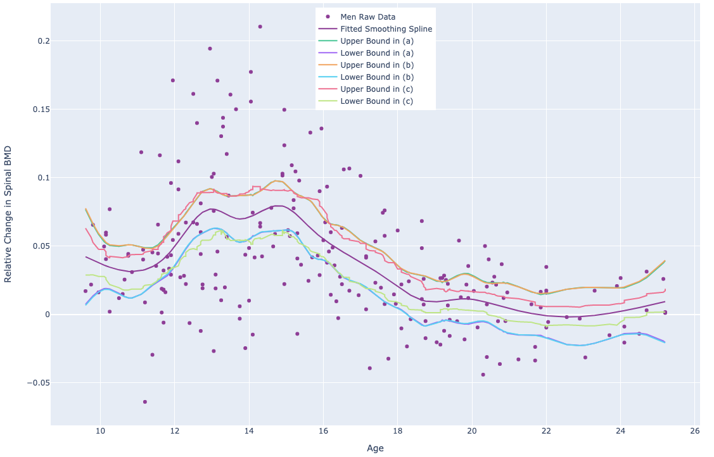

???+ question "Ex. 8.6"
    Consider the bone mineral density data of Figure 5.6.

	(a) Fit a cubic smooth spline to the relative change in spinal BMD, as a function of age. Use cross-validation to estimate the optimal amount of smoothing. Construct pointwise 90% confidence bands for the underlying function.
	
    (b) Compute the posterior mean and covariance for the true function via (8.28), and compare the posterior bands to those obtained in (a).
	
    (c) Compute 100 bootstrap replicates of the fitted curves, as in the bottom left panel of Figure 8.2. Compare the results to those obtained in (a) and (b).

??? done "Soln. 8.6"
    The relevant text are Section 5.5.2 and Section 8.2.1 in the text. We used 10-fold cross validation and chose the degree of freedom to be 14 in this example. Fitted cubic spline and bands from various methods are plotted in Figure 1 for men's bone mineral density data.

    
    <center>*Figure 1: Fitted Cubic Spline and 90% Standard Error Bands*</center>

??? example "Code"
    ```python
    import pathlib
    import numpy as np
    import pandas as pd
    from numpy.linalg import inv
    from numpy.linalg import multi_dot
    from sklearn.base import BaseEstimator
    from sklearn.model_selection import GridSearchCV
    from sklearn.metrics import mean_squared_error
    from sklearn.utils import resample
    import statsmodels.api as sm
    from patsy import dmatrix
    import plotly.graph_objects as go

    # get relative data folder
    PATH = pathlib.Path(__file__).resolve().parents[1]
    DATA_PATH = PATH.joinpath("data").resolve()

    # prepare data
    data = pd.read_csv(DATA_PATH.joinpath("boneMineralDensity.csv"), header=0)
    data_men = data.loc[data['gender'] == 'male']
    data_men = data_men.sort_values('age')
    X_men = data_men.loc[:, 'age'].to_numpy()
    y_men = data_men.loc[:, 'spnbmd'].to_numpy()

    data_women = data.loc[data['gender'] == 'female']
    data_women = data_women.sort_values('age')
    X_women = data_women.loc[:, 'age'].to_numpy()
    y_women = data_women.loc[:, 'spnbmd'].to_numpy()


    # define a cubic smooth spline estimator
    class CubicSmoothSpline(BaseEstimator):
        def __init__(self, df=10):
            self.df = df
            self.H = None
            self.fitNatural = None
            self.pred = None

        def fit(self, X, y=None):
            self.H = dmatrix('cr(x, df={})'.format(self.df), {'x': X}, return_type="dataframe")
            self.fitNatural = sm.GLM(y, self.H).fit()
            return self

        def predict(self, X):
            self.pred = self.fitNatural.predict(dmatrix('cr(xp, df={})'.format(self.df), {'xp': X}))
            return self.pred


    # (a) cross validation
    param_grid = [{'df': np.arange(5, 21)}]

    css = CubicSmoothSpline()
    grid_search = GridSearchCV(css, param_grid, cv=10, scoring='neg_mean_squared_error')
    grid_search.fit(X_men, y_men)
    final_model = grid_search.best_estimator_
    final_df = final_model.df
    print("The degree of freedom chosen by 10-fold CV is: {}".format(final_df))

    # calculate point-wise variance
    final_model.fit(X_men, y_men)
    final_model.predict(X_men)
    y_men_pred = final_model.pred
    sigma_square = mean_squared_error(y_men_pred, y_men)
    H = np.asarray(final_model.H)
    m_Sigma = sigma_square * (inv(np.matmul(H.transpose(), H)))
    m_nc = multi_dot([H, m_Sigma, H.transpose()])
    pt_var_nc = m_nc.diagonal()
    pt_std_nc = np.sqrt(pt_var_nc)
    upper = y_men_pred + 1.65 * pt_std_nc
    lower = y_men_pred - 1.65 * pt_std_nc

    # plot
    fig = go.Figure()
    fig.add_trace(go.Scatter(x=X_men, y=y_men,
                            mode='markers',
                            name='Men Raw Data',
                            line_color='#993399'))

    fig.add_trace(go.Scatter(x=X_men, y=y_men_pred,
                            mode='lines',
                            name='Fitted Smoothing Spline',
                            line_color='#993399'))

    fig.add_trace(go.Scatter(x=X_men, y=upper,
                            mode='lines',
                            name='Upper Bound in (a)'))

    fig.add_trace(go.Scatter(x=X_men, y=lower,
                            mode='lines',
                            name='Lower Bound in (a)'))

    # (b): from (8.28) with tau=10 and \Sigma = Identity matrix
    tau = 10
    n = H.shape[1]
    m_Sigma_2 = sigma_square * (inv(np.matmul(H.transpose(), H) + sigma_square / tau * np.identity(n)))
    m_nc_2 = multi_dot([H, m_Sigma_2, H.transpose()])
    pt_var_nc_2 = m_nc_2.diagonal()
    pt_std_nc_2 = np.sqrt(pt_var_nc_2)
    upper_2 = y_men_pred + 1.65 * pt_std_nc_2
    lower_2 = y_men_pred - 1.65 * pt_std_nc_2

    fig.add_trace(go.Scatter(x=X_men, y=upper_2,
                            mode='lines',
                            name='Upper Bound in (b)'))

    fig.add_trace(go.Scatter(x=X_men, y=lower_2,
                            mode='lines',
                            name='Lower Bound in (b)'))

    # (c) bootstrap method
    B = 100
    fitted_curve_list = []
    for b in np.arange(B):
        data_sample = resample(data_men, replace=True)
        data_sample = data_sample.sort_values('age')
        X_sample = data_sample.loc[:, 'age'].to_numpy()
        y_sample = data_sample.loc[:, 'spnbmd'].to_numpy()
        final_model.fit(X_sample, y_sample)
        y_pred = final_model.predict(X_sample)
        fitted_curve_list.append(y_pred)

    bs = np.stack(fitted_curve_list)
    upper_3 = np.percentile(bs, 90, axis=0, interpolation='nearest')
    lower_3 = np.percentile(bs, 10, axis=0, interpolation='nearest')

    fig.add_trace(go.Scatter(x=X_men, y=upper_3,
                            mode='lines',
                            name='Upper Bound in (c)'))

    fig.add_trace(go.Scatter(x=X_men, y=lower_3,
                            mode='lines',
                            name='Lower Bound in (c)'))

    fig.update_layout(
        xaxis_title="Age",
        yaxis_title="Relative Change in Spinal BMD",
    )

    fig.update_layout(legend=dict(
        yanchor="top",
        y=0.99,
        xanchor="center",
        x=0.5
    ))

    fig.show()
    ```