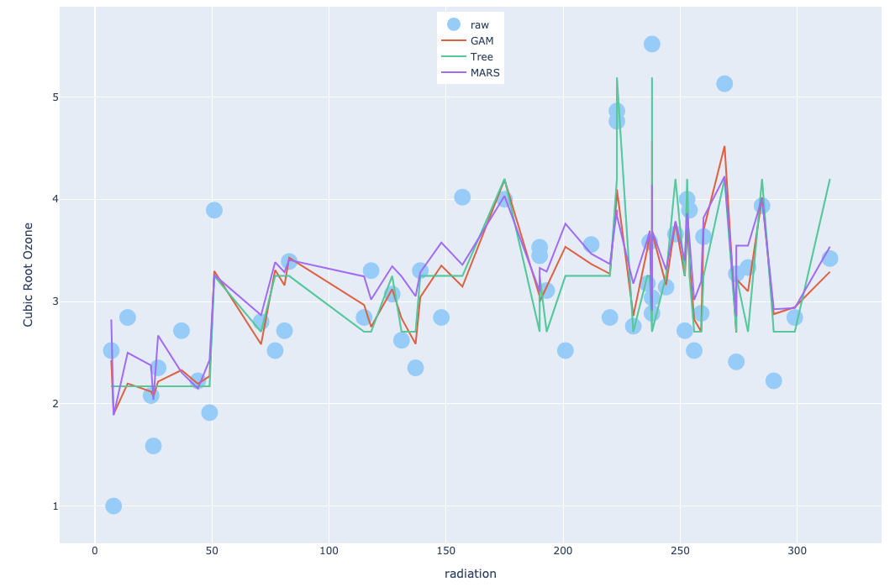

???+ question "Ex. 9.6"
    Consider the ozone data of Figure 6.9.
	
	(a) Fit an additive model to the cube root of ozone concentration as a function of temperature, wind speed, and radiation. Compare your results to those obtained via the trellis display in Figure 6.9.
	
    (b) Fit trees, MARS, and PRIM to the same data, and compare the results to those found in (a) and in Figure 6.9.

??? done "Soln. 9.6"
    We include Figure 1 as an example (similar to Figure 6.9 in the text). It seems that, compared to three-dimensional smoothing example in Figure 6.9, fitted curves from GAM and MARS are more irregular, so does the one from the tree method. 

    
    <center>*Figure 1: Ozone Data Example with GAM, Tree and MARS*</center>

??? example "Code"
    ```python
    import pathlib
    import numpy as np
    import pandas as pd
    import prim
    from pyearth import Earth
    from pygam import LinearGAM, s
    from plotly.subplots import make_subplots
    import plotly.graph_objects as go
    from sklearn.tree import DecisionTreeRegressor
    from sklearn.metrics import mean_squared_error

    # get relative data folder
    PATH = pathlib.Path(__file__).resolve().parents[1]
    DATA_PATH = PATH.joinpath("data").resolve()

    # ozone data
    data = pd.read_csv(DATA_PATH.joinpath("ozone.csv"), header=0)
    X = data.loc[:, 'radiation':'wind']
    y = pd.DataFrame(data.loc[:, 'ozone'])
    y['ozone'] = np.power((y['ozone']), 1 / 3)

    # fit GAM
    reg_gam = LinearGAM(s(0) + s(1) + s(2)).fit(X, y)
    # reg_gam.summary()
    y_pred_gam = reg_gam.predict(X)
    print('MSE for GAM is {:.2f}'.format(mean_squared_error(y_pred_gam, y)))

    # fit tree
    reg_tree = DecisionTreeRegressor(max_leaf_nodes=5)
    reg_tree.fit(X, y)
    y_pred_tree = reg_tree.predict(X)
    print('MSE for tree is {:.2f}'.format(mean_squared_error(y_pred_tree, y)))

    # fit MARS
    reg_mars = Earth()
    reg_mars.fit(X, y)
    # print(reg_mars.summary())
    y_pred_mars = reg_mars.predict(X)
    print('MSE for MARS is {:.2f}'.format(mean_squared_error(y_pred_mars, y)))

    # plot 4 * 4
    data_plot = X
    data_plot['y'] = y
    data_plot['y_pred_gam'] = y_pred_gam
    data_plot['y_pred_mars'] = y_pred_mars
    data_plot['y_pred_tree'] = y_pred_tree

    data_pct = data_plot
    data_pct = data_pct.sort_values('radiation')
    data_pct = data_pct[data_pct['wind'] < data_pct['wind'].quantile(0.75)]
    data_pct = data_pct[data_pct['temperature'] < data_pct['temperature'].quantile(0.75)]

    # Create traces
    fig = go.Figure()
    fig.add_trace(go.Scatter(x=data_pct['radiation'], y=data_pct['y'],
                            mode='markers',
                            marker=dict(
                                        color='LightSkyBlue',
                                        size=20
                                    ),
                            name='raw'))

    fig.add_trace(go.Scatter(x=data_pct['radiation'], y=data_pct['y_pred_gam'],
                            mode='lines',
                            name='GAM'))


    fig.add_trace(go.Scatter(x=data_pct['radiation'], y=data_pct['y_pred_tree'],
                            mode='lines',
                            name='Tree'))


    fig.add_trace(go.Scatter(x=data_pct['radiation'], y=data_pct['y_pred_mars'],
                            mode='lines',
                            name='MARS'))

    fig.update_layout(
        xaxis_title="radiation",
        yaxis_title="Cubic Root Ozone",
    )

    fig.update_layout(legend=dict(
        yanchor="top",
        y=0.99,
        xanchor="center",
        x=0.5
    ))
    fig.show()
    ```