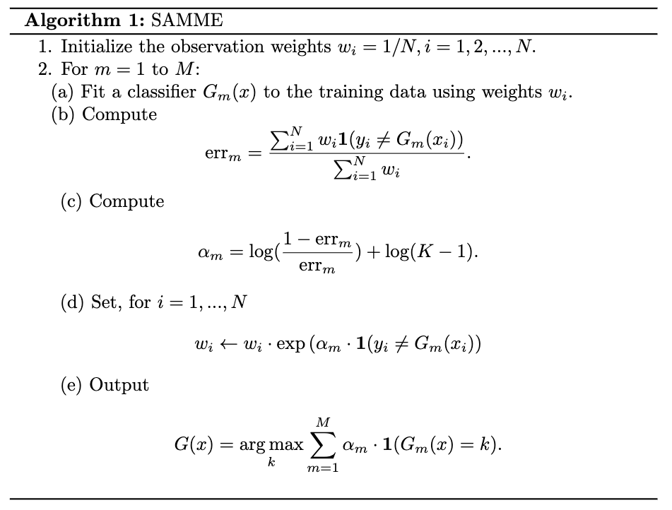

???+ question "Ex. 10.5"
    *Multiclass exponential loss* (Zhu et al., 2005 \cite{hastie2009multi}). For a $K$-class classification problem, consider the coding $Y=(Y_1,...,Y_K)^T$ with
	
    \begin{equation}
		Y_k = \begin{cases}
			1, & \text{ if } G=\mathcal{G}_k\\
			-\frac{1}{K-1}, & \text{ otherwise. }
		\end{cases}\non
	\end{equation}
	
    Let $f=(f_1,...,f_K)^T$ with $\sum_{k=1}^Kf_k=0$, and define
	
    \begin{equation}
		L(Y,f) = \exp\left(-\frac{1}{K}Y^Tf\right).\non
	\end{equation}
	
    ???+ question "(a)"
        Using Lagrange multipliers, derive the population minimizer $f^\ast$ of $L(Y, f)$, subject to the zero-sum constraint, and relate these to the class probabilities.
	???+ question "(b)"
        Show that a multiclass boosting using this loss function leads to a reweighting algorithm similar to AdaBoost, as in Section 10.4.

??? done "Soln. 10.5"
    ??? done "(a)"
        We follow the similar arguments in [Ex. 10.2](ex10-02.md). We're interested in
        
        \begin{equation}
            \underset{f(x)}{\operatorname{argmin}} E_{Y|x} \left[\exp\left(-\frac{1}{K}\big(Y_1f_1(x) + ... + Y_Kf_K(x)\big)\right)\right]\non
        \end{equation}
        
        subject to 

        \begin{equation}
            f_1(x) + ... + f_K(x) = 0.\non
        \end{equation}
        
        The Lagrange multiplier, denoted as $H(f_1,...,f_k,\lambda)$, becomes
        
        \begin{eqnarray}
            &&P(Y=1|x)\cdot \exp\left(-\frac{1}{K}f_1(x)-\frac{1}{K-1}(f_2(x) +...+f_K(x))\right)\non\\
            &+&P(Y=2|x)\cdot \exp\left(-\frac{1}{K}f_2(x)-\frac{1}{K-1}(f_1(x) + f_3(x)...+f_K(x))\right)\non\\
            &+&...\non\\
            &+&P(Y=K|x)\cdot \exp\left(-\frac{1}{K}f_K(x)-\frac{1}{K-1}(f_1(x) + f_2(x)...+f_{K-1}(x))\right)\non\\
            &-&\lambda (f_1(x) +...+f_K(x)) \label{eq:10.5multi}
        \end{eqnarray}

        Note that $f_1(x) + ... + f_K(x) = 0$, so $\eqref{eq:10.5multi}$ simplifies to
        
        \begin{eqnarray}
            &&P(Y=1|x)\cdot \exp\left(-\frac{1}{K-1}f_1(x)\right)\non\\
            &+&P(Y=2|x)\cdot \exp\left(-\frac{1}{K-1}f_2(x)\right)\non\\
            &+&...\non\\
            &+&P(Y=K|x)\cdot \exp\left(-\frac{1}{K-1}f_K(x)\right)\non\\
            &-&\lambda (f_1(x) +...+f_K(x)).
        \end{eqnarray}

        For $k=1, ..., K$, setting $\frac{\partial H}{\partial f_k(x)} = 0$ and $\frac{\partial H}{\partial \lambda} = 0$ yields
        
        \begin{eqnarray}
            -\frac{1}{K-1}P(Y=k|x)\cdot \exp\left(-\frac{1}{K-1}f_k(x)\right) -\lambda &=& 0, \text{ for } k =1,...,K\non\\
            f_1(x) + ... + f_K(x) &=& 0.\non
        \end{eqnarray}
        
        Note that we have $K+1$ equations with $K+1$ unknowns. We first represent $f_k(x)$ in terms of $\lambda$ by the first set of equations above:
        
        \begin{eqnarray}
        f^\ast_k(x) &=&-(K-1)\log\left(\frac{(K-1)\lambda}{P(Y=k|x)}\right)\non\\
        &=&(K-1)\log\left(P(Y=k|x)\right) - (K-1)\log((K-1)\lambda)\label{eq:fkx}
        \end{eqnarray}

        Then by $\sum_{k=1}^Kf^\ast_k(x)=0$ we have

        \begin{equation}
            \sum_{k=1}^K\Big((K-1)\log\left(P(Y=k|x)\right) - (K-1)\log((K-1)\lambda)\Big) = 0\non
        \end{equation}
        
        so that
        
        \begin{equation}
        \label{eq:10lambda}
            \lambda = \frac{1}{K-1}\prod_{k=1}^KP(Y=k|x)^{\frac{1}{K}}.
        \end{equation}
        
        Plug $\lambda$ above back to $\eqref{eq:fkx}$ we obtain that for $k = 1,...,K$, 
        
        \begin{equation}
            f^{\ast}_k(x) = (K-1)\log\left(P(Y=k|x)\right) - \frac{K-1}{K}\sum_{\tilde k=1}^K\log P(Y=\tilde k|x).\non
        \end{equation}

        Once $f^\ast_k(x)$ are estimated for $k=1,...,K$, we are able to estimate $P(Y=k|x)$ in terms of $f^\ast_k(x)$. From $\eqref{eq:fkx}$ and $\eqref{eq:10lambda}$, we obtain for $k=1,...,K$,
        
        \begin{equation}
        \label{eq:pyk}
            P(Y=k|x) = \exp\left(\frac{f^\ast_k(x)}{K-1}\right) \cdot \left(\prod_{j=1}^KP(Y=j|x)^{\frac{1}{K}}\right).
        \end{equation}
        
        Summing $P(Y=k|x)$ for $k=1,...,K$ we obtain
        
        \begin{equation}
            1 = \left(\prod_{j=1}^KP(Y=j|x)^{\frac{1}{K}}\right) \cdot \Bigg(\sum_{k=1}^K\exp\left(\frac{f^\ast_k(x)}{K-1}\right)\Bigg),\non 
        \end{equation}
        
        thus
        
        \begin{equation}
            \left(\prod_{j=1}^KP(Y=j|x)^{\frac{1}{K}}\right) = \Bigg(\sum_{k=1}^K\exp\left(\frac{f^\ast_k(x)}{K-1}\right)\Bigg)^{-1}.
        \end{equation}
        
        Plugging equation above back to $\eqref{eq:pyk}$ we get
        
        \begin{equation}
            P(Y=k|x) = \frac{\exp\left(\frac{f^\ast_k(x)}{K-1}\right)}{\sum_{k=1}^K\exp\left(\frac{f^\ast_k(x)}{K-1}\right)}.\non
        \end{equation} 
    
    ??? done "(b)"
        Following the idea of two-class AdaBoost, we start with a Stagewise Additive Modeling using a Multi-class Exponential loss function (SAMME).
        
        
        
*SAMME*

        Note that SAMME shares the same simple modular structure of AdaBoost with a simple but subtle different in (c), specifically, the extra term $\log(K-1)$.

        The link between exponential loss function and SAMME follows the same arguments in Section 10.4. Specifically, we have as (10.12),

        \begin{equation}
            \beta_m = \frac{(K-1)^2}{K}\left(\log\frac{1-\text{err}_m}{\text{err}_m} + \log (K-1)\right).\non
        \end{equation} 