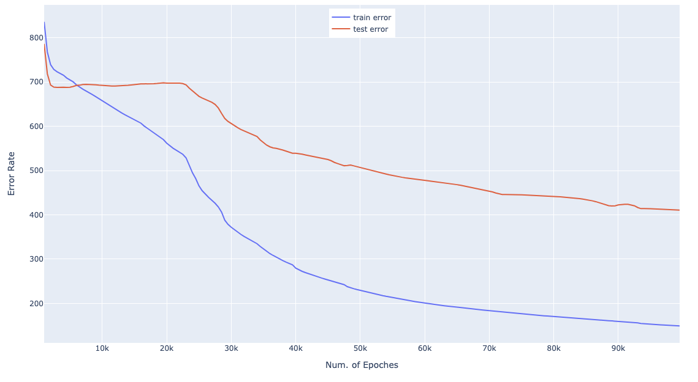

???+ question "Ex. 11.5"
	(a) Write a program to fit a single hidden layer neural network (ten hidden units) via back-propagation and weight decay.
	
    (b) Apply it to 100 observations from the model
	
    \begin{equation}
		Y = \sigma(a_1^TX) + (a_2^TX)^2 + 0.30 \cdot Z,\non
	\end{equation}
	
    where $\sigma$ is the sigmoid function, $Z$ is standard normal, $X^T=(X_1, X_2)$, each $X_j$ being independent standard normal, and $a_1^T=(3,3)$, $a_2^T=(3, -3)$. Generate a test sample of size 1000, and plot the training and test error curves as a function of the number of training epochs, for different values of the weight decay parameter. Discuss the overfitting behavior in each case.
	
    (c) Vary the number of hidden units in the network, from 1 up to 10, and determine the minimum number needed to perform well for this task.

??? done "Soln. 11.5"
    Figure 1 below shows the error rate versus number of epoches for a network with 10 hidden units. 
    
    
    <center>*Figure 1: Error Rates for A Neural Network Regressor*</center>
    
??? example "Code"
    ```python
    import numpy as np
    import pandas as pd
    import plotly.graph_objects as go
    from sklearn.preprocessing import StandardScaler
    from sklearn.metrics import mean_squared_error
    from sklearn.neural_network import MLPRegressor


    def sigmoid(x):
        return 1 / (1 + np.exp(-x))


    def get_data(size):
        mean = [0, 0]
        cov = [[1, 0], [0, 1]]
        a1 = np.array([3, 3])
        a2 = np.array([3, -3])
        X = np.random.multivariate_normal(mean, cov, size=size)
        Z = np.random.normal(loc=0, scale=1, size=size)
        Y = sigmoid(np.dot(a1, X.T)) + np.square(np.dot(a2, X.T)) + 0.3 * Z
        Y = Y.T
        return [X, Y]


    X_train, y_train = get_data(100)
    X_test, y_test = get_data(1000)

    # scale data
    scaler = StandardScaler()
    scaler.fit(X_train)
    X_train = scaler.transform(X_train)
    X_test = scaler.transform(X_test)

    # NN regressor
    train_epochs = np.arange(1000, 100000, 500)
    weight_decay_coefs = [0.001]
    hidden_units = np.arange(10, 11)

    hidden_unit_list = []
    train_error_list = []
    test_error_list = []
    epoch_list = []
    weight_decay_list = []

    for weight_decay_coef in weight_decay_coefs:
        for train_epoch in train_epochs:
            for hidden_unit in hidden_units:
                print('alpha is : {}, epoch is {}, hidden unit is {}'.format(
                    weight_decay_coef, train_epoch, hidden_unit))

                regr = MLPRegressor(random_state=1,
                                    hidden_layer_sizes=(hidden_unit,),
                                    max_iter=train_epoch,
                                    alpha=weight_decay_coef,
                                    activation='logistic').fit(X_train, y_train)
                y_train_pred = regr.predict(X_train)
                y_test_pred = regr.predict(X_test)
                train_error = mean_squared_error(y_train, y_train_pred)
                test_error = mean_squared_error(y_test, y_test_pred)

                hidden_unit_list.append(hidden_unit)
                weight_decay_list.append(weight_decay_coef)
                epoch_list.append(train_epoch)
                train_error_list.append(train_error)
                test_error_list.append(test_error)

    df = pd.DataFrame({'num. hidden unit': hidden_unit_list,
                    'num. epoch': epoch_list,
                    'weight decay': weight_decay_list,
                    'train error': train_error_list,
                    'test error': test_error_list})
    print(df)

    df_tmp = df.loc[df['num. hidden unit'] == 10]
    df_tmp = df_tmp[df_tmp['weight decay'] == 0.001]

    # Create traces
    fig = go.Figure()
    fig.add_trace(go.Scatter(x=df_tmp['num. epoch'], y=df_tmp['train error'],
                            mode='lines',
                            name='train error'))
    fig.add_trace(go.Scatter(x=df_tmp['num. epoch'], y=df_tmp['test error'],
                            mode='lines',
                            name='test error'))
    fig.update_layout(
        xaxis_title="Num. of Epoches",
        yaxis_title="Error Rate",
    )

    fig.update_layout(legend=dict(
        yanchor="top",
        y=0.99,
        xanchor="center",
        x=0.5
    ))

    fig.show()

    ```